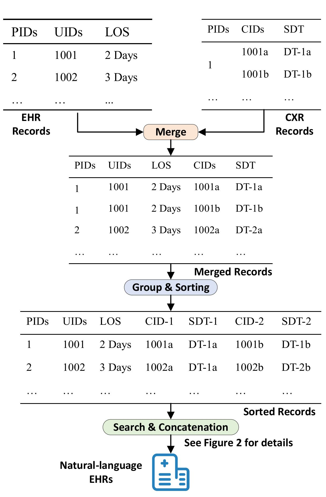
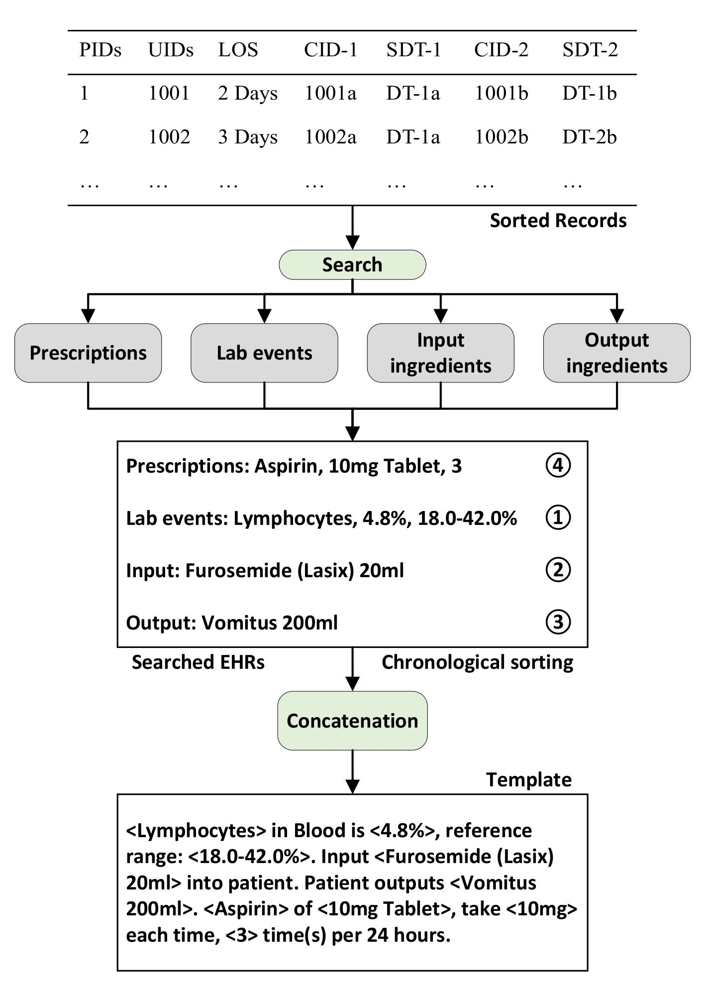

# Dataset: MIMIC-TME

## Construction

In this work, we construct a novel MIMIC-TME dataset, which contains textual medical events from MIMIC-IV (a publicly available dataset of medical events that can be linked to MIMIC-CXR). MIMIC-IV is composed of several spreadsheets, each of them records different type of medical events, such as prescriptions, lab events (e.g., blood test) and micro biology events, possessing associated identifiers that can link to MIMIC-CXR. Examples of MIMIC-IV are shown in Table 1, note that all patients in Table 1 are de-identified in order to protect personal privacy, which means any information that could potentially be used to identify individuals, such as their name, address, or social security number, has been altered.

*Table 1: Examples of MIMIC-IV. "item" represents the ingredients tested in lab. "prod strength" means product strength, which is a free-text description of the composition of the prescribed medication.*

| PIDs | UIDs | Lab events (item) | Lab events (value) | Lab events (reference range) | Prescriptions (drug) | Prescriptions (prod strength) | Prescriptions (doses / 24h) |
| ---- | ---- | ----------------- | ------------------ | ---------------------------- | -------------------- | ----------------------------- | --------------------------- |
| 1    | 1001 | Lymphocytes       | 4.8%               | 18.0-42.0%                   | Aspirin              | 10mg Tablet                   | 3                           |
| 2    | 1002 | Bicarbonate       | 30.0mg/L           | 22.0-32.0mg/L                | Ibuprofen            | 20mg Tablet                   | 3                           |
| 3    | 1003 | Hemoglobin        | 90g/L              | 110-170g/L                   | Heparin              | 100 Units                     | 2                           |
| ...  | ...  | ...               | ...                | ...                          | ...                  | ...                           | ...                         |

Our MIMIC-TME dataset generation pipeline is illustrated in Figure 1 and Figure 2. We first deploy a *data processing approach* on MIMIC-IV, which iteratively extracts identifiers (IDs) that represent their admissions or Intensive Care Unit (ICU) stays, including patient IDs (PIDs, one ID uniquely corresponds to one patient), ICU stay IDs (UIDs, one ID represents one recorded stay in ICU) and Length of Stays (LOS). MIMIC-CXR also shares the same PIDs and records some other information, including CXR study IDs (CIDs, one ID uniquely corresponds to one CXR pair), Study Date Time (SDT, timestamp of corresponding CXR imaging). Subsequently, we merge the two datasets by the shared PIDs, ensuring that all the patients in MIMIC-CXR have experienced hospitalization recorded in MIMIC-IV at least once. Considering that in practice, incorporating all contents in MIMIC-IV incurs overly abundant information, we remove records with LOS less than 24 hours, and only select CXR pairs acquired within 24 hours before admission and within 48 hours after admission according to SDT. After this, we group the merged dataset by the combination PIDs and UIDs, so that each group shares the same PID and UID, possessing one or more CID(s), i.e., one or more CXR pair(s). Given the requirement of providing chronological CXR study, we preserve those groups containing at least two CIDs, to ensure that there must be over two chronological CXR pairs. Finally, every two pairs in one group are combined and chronologically sorted via their corresponding SDTs, until all the pairs are involved. In this manner, we convert the records into a set of doublets, where each doublet contains two chronological CIDs with unique PID, UID and LOS.

 

*Figure 1：Generation pipeline of MIMIC-TME dataset.*

On the above basis, the PID, UID and paired CIDs in one doublet can uniquely search the only matched records from MIMIC-IV. In this paper, we only choose prescriptions, lab events (such as blood test), input ingredients (patients' take-in ingredients in ICU) and output ingredients (patients' responses to the input ingredients) as medical events, attributed to their medical efficacy in health care. Moreover, aiming to avoid directly encoding sparse and discrete medical events in MIMIC-IV that are not compatible enough for encoders, we organize these medical events by using continuous natural languages. Specifically, we design a template for each event type and concatenate them in chronological order, the searching, concatenation and template are illustrated in Figure 2.

 

*Figure 2: Details of search and concatenation. In the template, words in **bold** are shared narrative architecture, "$<\cdot>$" encloses matched events.*

## Statistics

We sample 90% of MIMIC-TME as training set, 4% as validation set and 6% as test set. Considering view-position consistency, we only consider frontal CXR images, i.e., "Anterior-Posterior (AP)" and "Posterior-Anterior (PA)". Statistics of dataset are in Table 2.

*Table 2: Statistics for MIMIC-TME dataset.*

| Training set    | Validation set | Test set       |
| --------------- | -------------- | -------------- |
| 22,359 Doublets | 994 Doublets   | 1,490 Doublets |

